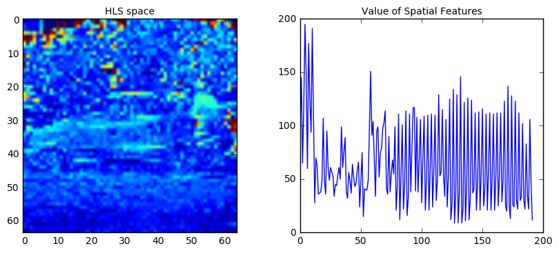
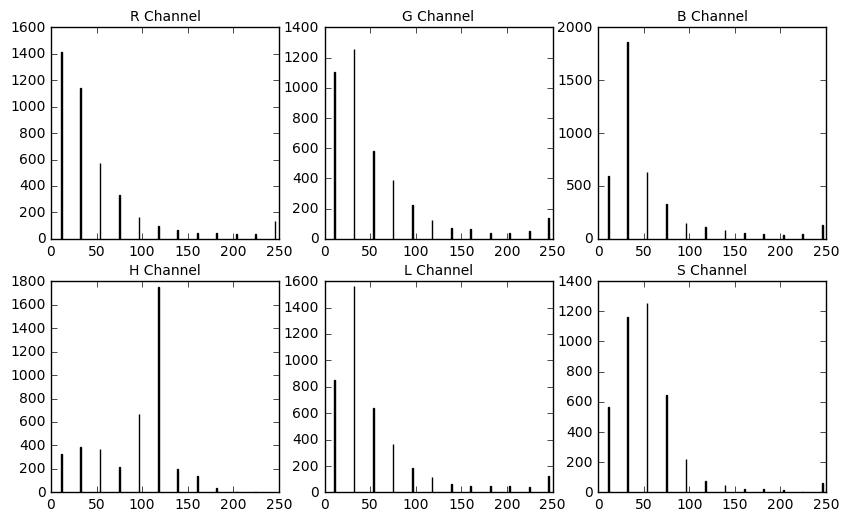
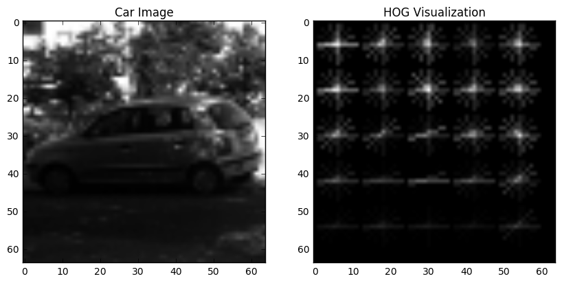
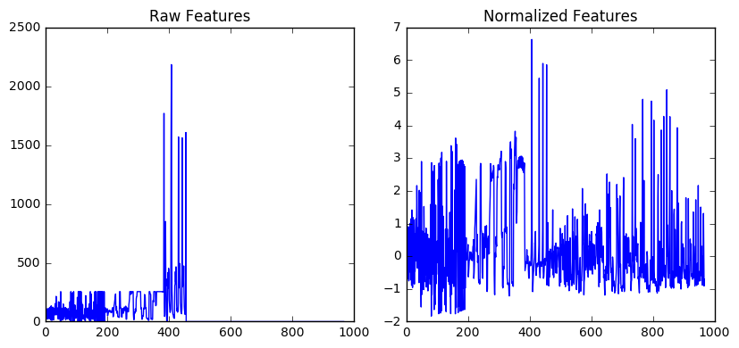
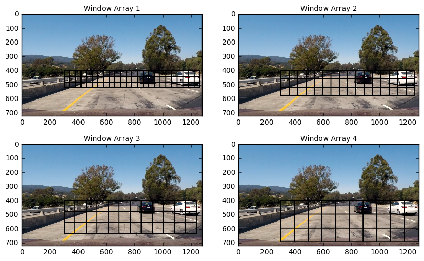
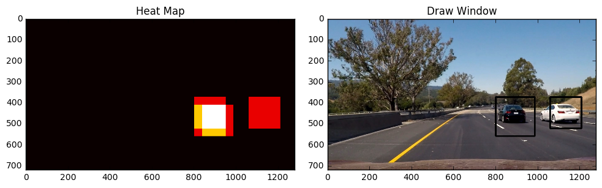
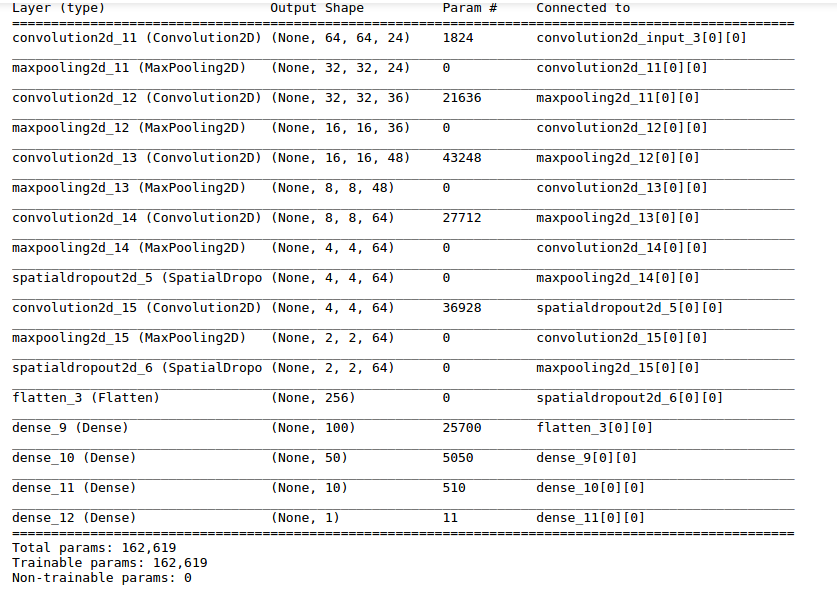

# Vehicle Detection and Tracking

[](http://www.udacity.com/drive)


The goals / steps of this project are the following:

* Perform a Histogram of Oriented Gradients (HOG) feature extraction on a labeled training set of images and train a classifier to recognize cars inthe image.
* Apply a color transform and append binned color features, as well as histograms of color, to the HOG feature vector. 
* Normalize the features and randomize a selection for training and testing.
* Implement a sliding-window technique and use the trained classifier to search for vehicles in images.
* Run the pipeline on a video stream and create a heat map of recurring detections frame by frame to reject outliers and follow detected vehicles.
* Estimate a bounding box for vehicles detected.

Here are links to the labeled data for [vehicle](https://s3.amazonaws.com/udacity-sdc/Vehicle_Tracking/vehicles.zip) and [non-vehicle](https://s3.amazonaws.com/udacity-sdc/Vehicle_Tracking/non-vehicles.zip) examples to train the classifier.  These example images come from a combination of the [GTI vehicle image database](http://www.gti.ssr.upm.es/data/Vehicle_database.html), the [KITTI vision benchmark suite](http://www.cvlibs.net/datasets/kitti/), and examples extracted from the project video itself. 

Some example images for testing the pipeline on single frames are located in the `test_images` folder. 

The video stream is split into frames in the `RoadSensor` class. In the `RoadSensor` class pipeline, the image is analyzed to find the traffic lanes from project 4, and the vehicles for this project.

Classes for lane detection are contained in `lftools.py`. Classes for vehicle detection are contained in `vdtools.py`. To run the script, the following code can be used:

```python
from road_sensor import RoadSensor
obj = RoadSensor()
obj.run('path/to/video.mp4')
```

The pipeline performs the vehicle detection and tracking on each frame.The results are visualized and overlaid on the original images:

* Heatmap: Green areas
* Bounding boxes of cars: Maroon boxes.

The videos produced can be found in the following links.

* [Link to my video result with only vehicle detection](https://youtu.be/w2NC-Owd-jI)
* [Link to result with vehicle and lane detection](https://www.youtube.com/)

For more information regarding the lane finding techniques used please see this [link.](https://github.com/t-lanigan/advanced-lane-detection)


# Feature Definition

In order to classify images as _cars_ and _non-cars_ a classifier needs to be created. Two approaches are explored in this project: using a convolutional neural network, and using a classifier trained on extracted features. The features used to train the classifier are as follows:

* Spatial Features
* Colour Histogram Features
* Histogram of Oriented Gradients (HOG) features


## Spatial Features

Spatial features are the raw pixel values of the images flattened into a vector. This operation can be performed on different solor spaces. IN this project, both the HLS and the RGB colour spaces are used to generate spatial features. An example is as follows:



## Colour Histogram Features

A histogram of the color values in an image can be very telling. For example, a saturated red is a colour not typically found in nature, however, there are many cars that are painted this colour. A histogram of each image is taken in the RGB and HLS colour spaces and the values are used as features for the classifier. An example histogram for the above image is shown below:



## Histogram of Oriented Gradients (HOG) Features

A Histogram of Oriented Gradients was also used to extract features from the images. The way it works, is gradients of the pixel values in the images are first taken. The direction of the gradients is then determined, and a histogram of those directions are produced. In this way, a signature set of features can be produced for images of different objects. An example is as follows:



Each cell in the HOG features contains 12x12 = 144 pixels. Each of the gradients are slotted into 8 different directional bins.

## Feature scaling

As the spatial, color histogram, and HOG features are all on different scales, it is important to perform feature normalization to ensure the classifier does not learn to recognize a certain feature as being more important than others based on its scale. More on this can be found in this [example that I wrote for Sklearn](http://scikit-learn.org/dev/auto_examples/preprocessing/plot_scaling_importance.html#sphx-glr-auto-examples-preprocessing-plot-scaling-importance-py). Normalization is done using the `StandardScaler()` class from Sklearn. The result of the normalization is shown below:



## Features summary

The total parameters used and amount of features are as follows:

**Spatial feature parameters:**

* spatial = 8 
* channels:  HLS and RGB
* number of features = 384

**Color histogram feature parameters:**

* hist_bins = 12 
* channels: HLS and RGB
* number of features = 72

**HOG feature parameters:**

* orient = 8
* pix_per_cell = 12
* cell_per_block = 2
* channels: Grey scale
* number of features = 512

**Total number of feature:** 968

# Training a classifier

A few different classifiers are examined for this project. A LinearSVC from Sklearn is a great candidated becuase it is fast, and [used typically in pedestrian detection](https://rodrigob.github.io/documents/2014_eccvw_ten_years_of_pedestrian_detection_with_supplementary_material.pdf). Also examined are RandomForest and Adaboost algorithms, as boosting algorithms perform very well in feature based classification problems.

## Selecting a performance metric

The performance metric used in this binary classification problem (car or non-car) is _recall_. The training data used for the classifier is, for the most part, balanced, however it is anticipated that in the testing environment there will be far more _non-car_ images tested. Furthermore, filtering using a heatmap (explained in a later section) is going to take place, so precision are not a major concern. Therefore having a classifier that can correctly identify a car every time is more critical.

## Benchmark Testing

The following is output from benchmark testing each of these algorithms:
```
Training a RandomForestClassifier...
Extracting features from 15000 samples...
Running time : 82.265588 seconds
Pickling features...
11.87 Seconds to train CLF...
Test Recall of CLF =  0.9888
Pickling classifier and scaler...

Training a AdaBoostClassifier classifier...
Loading saved features...
Extracting features from 15000 samples...
Running time : 78.401433 seconds
352.79 Seconds to train CLF...
Test Recall of CLF =  0.9749
Pickling classifier and scaler...

Training a LinearSVC classifier...
Extracting features from 15000 samples...
Running time : 78.401433 seconds
Pickling features...
23.82 Seconds to train CLF...
Test Recall of CLF =  0.9678
Pickling classifier and scaler...
```

As can been, the RandomForest Algorithm has a higher recall then the other two algorithms. Performance is not considered in this case, as our system will not be a real time system. RandomForest is therefore selected for optimization. 

## Model Optimization

Using the a grid search implemented in the following code, the RandomForest model was optimized:


```python
ran_state = 42

clf = RandomForestClassifier(random_state=ran_state)
# Create the parameters list you wish to tune
parameters = {'max_features' : [3, 4, 6],
              'max_depth'    : [4, 8, 25],
              'min_sample_leaf': [2, 4]}

# Create the Stratified Shuffle Split object
ss = ShuffleSplit(y_train, n_iter=5, test_size=0.2, random_state=ran_state)

# Make an scoring function using 'make_scorer'
scorer = make_scorer(recall_score, pos_label="yes")

# Create a grid search object, and use the sss object in place of cv parameter
grid_obj = GridSearchCV(clf, param_grid=parameters, scoring=scorer,
                       cv=ss)

# Fit the grid search object to the training data and find the optimal parameters
grid_obj.fit(X_train, y_train)

# Get the estimator
clf = grid_obj.best_estimator_
```

The best parameters for the RandomForest classifier are as follows:

* n_estimators = 100
* max_features = 2
* min_samples_leaf = 4
* max_depth = 25

# Image pipeline

The video feed is split into frames and fed into a processing pipeline. The steps taken to process the images are as follows:

1. A set of smaller windows in the images are created
2. Features are extracted from each window and fed into a classifier to produce a prediction.
3. Windows that are predicted as having a car above a certain threshold probability are added to a heatmap of the image.  where each identified window adds 1 to the heatmap.
3. The heatmap is thresholded so that areas with less heat are removed (helping account for false positives.
4. Heat is carried through each frame, and depreciated using a moving average.
4. When 'heat' has been in a certain area of the image for long enough, a Car object is created. 
5. A box is drawn around the centroid of the car object.


## Window Creation

Windows are created in multiple scales. The idea is that cars that are closer will require a larger window than cars that are on the horizon. Four different scales of windows are used and are shown in the following image:



Each window's feature are extracted after being resized to the training size (64x64). All parameters for controlling how windows are contained in the `WindowFinder` class. Parameters for controlling which features an classifier are using are contained in the `__init()__` constructor:

```python

class WindowFinder(object):
    """Finds windows in an image that contain a car."""
    def __init__(self):
        
        ### Hyperparameters, if changed ->(load_saved = False) If
        ### the classifier is changes load_feaures can be True

        self.load_saved     = True# Loads classifier and scaler
        self.load_features  = True # Loads saved features (to train new classifier)

        self.sample_size    = 15000 # How many to sample from training set
        self.color_space    = ['HLS', 'RGB'] # Can be RGB, HSV, LUV, HLS, YUV, YCrCb
        self.orient         = 8  # HOG orientations
        self.pix_per_cell   = 12 # HOG pixels per cell
        self.cell_per_block = 2 # HOG cells per block
        self.hog_channel    = 0 # Can be 0, 1, 2, or "ALL"
        self.spatial_size   = (8, 8) # Spatial binning dimensions
        self.hist_bins      = 12   # Number of histogram bins
        self.spatial_feat   = True # Spatial features on or off
        self.hist_feat      = True # Histogram features on or off
        self.hog_feat       = True # HOG features on or off


        # The locations of all the data.
        self.notcar_data_folders = ['./data/non-vehicles/Extras',
                                    './data/non-vehicles/GTI']

        self.car_data_folders    = ['./data/vehicles/GTI_MiddleClose',
                                    './data/vehicles/GTI_Far',
                                    './data/vehicles/KITTI_extracted',
                                    './data/vehicles/GTI_Right',
                                    './data/vehicles/GTI_Left']

        ######Classifiers                            
        self.pred_thresh = 0.60 #Increase to decrease likelihood of detection.
        
        ###### Variable for Classifier and Feature Scaler ##########
        self.untrained_clf = RandomForestClassifier(n_estimators=100, max_features = 2,
                             min_samples_leaf = 4,max_depth = 25)


               
        self.trained_clf, self.scaler = self.__get_classifier_and_scaler()

        ###### Variables for CNN ##########

        print('Loading Neural Network...')
        self.nn = load_model('models/keras(32x32).h5')
        self.nn_train_size = (32,32) # size of training data used for CNN
        self.nn.summary()
        print('Neural Network Loaded.')
        
        
```


## Heatmap

A heatmap is created by using the area of all windows identified as being a car and adding 1 to the value of the heatmap in the windows area. The following image is a search grid area, with corresponding identified car windows, or "hot_boxes"


The next step is to add to the heatmap using the identified areas.




The hot areas are identified using `scipy.ndimage.measurements.label`

 
## Vehicle Tracking


A `Car` object to track the detected cars. They contain four attributes:

* `average_centroid`
* `width`
* `height`
* `detected`


The `detected` attribute is a measurement of the probability of detection If the car object is detected in a frame, the value will increases. If the car object is not detected, the value will decrease. 

The `VehicleTracker` class has two different variables that are updated across frames: `self.heatmap` and `self.detected_cars`. The `self.heatmap` is a current heatmap that takes into account multiple frames. The `self.detected_cars` is a array of cars that have been identified as 'detected'. If a cars detected probability calls below a certain threshold, it is removed from the list.

In each frame, a new heat map `new_heatmap` is created. Then the variable `self.heatmap` for the `VehicleTracker` is updated using a moving average formula:

```python
alpha = 0.9
 self.heatmap = alpha*heatmap + (1-alpha)*new_heatmap
```

The advantage of this method is that it doesn't need to store all the previous values, and only keeps the value of the moving average. The old value decreases exponentially and fades out. 

After finding the bounding boxes. The distance between the centroid of the bounding box to the centroid of previously detected cars is calculated to see find if there is a nearby car object.


If the distance is within a threshold, the previous car object is updated with the new centroid, width, and height using a moving average. If no car is found nearby, a new car object is created.

The `new_cars` is then combined with `self.detected_cars`.  If the `detected` value is greater than the threshold, it is kept and if not discarded.


Finally, the `detected` values of each of the self.detected_cars is depreciated using an exponential formula.
```python
beta = 0.9
    for car in self.detected_cars:
        car.detected = car.detected*beta
```

## Convolutional Neural Networks (CNNs)

To explore using a CNN as the main classifier in this project, a Jupyter notebook was created: `playgrou-nn-model.ipynb`. CNN's work well for image classification especially now that new methods such as dropout and weight regularization have been developed to prevent them from overfitting. A CNN was designed with the following architecture:



A CNN has the advantage of not needing the feature extraction step on each of the windows. As well, a CNN can be optimized to run very quickly using a GPU and the [cuDNN library](https://developer.nvidia.com/cudnn). Both of these attributes make it a great candidate for use in a self-driving car, where image processing needs to take place in real time.

The network train for this project, however, performed poorly when compared to the RandomForest classifier. More development on the architecture would need to take place.


# Discussion

From the heatmap boxes in the video, it can seen that the classifier gets many false positives, especially on the sides rails. This highlights a need to work more on the machine learning based image detection algorithm. A tempting candidate is a convolutional neural network, however the initial investigation into using CNNs did not yield better results than the RandomForest classifier.

It is evident that the very high validation results (_~98.8%_) and lower test results from all of the false positives in the video means that the classifier is overfitting drastically. One method for overcoming this would be to obtain more data and perform data augmentation. A properly designed CNN with lots of data, data augmentation, and using dropout and regularization would be considered to be idea, however this is out of the scope of this project.

Finally, the results obtained can be further improved using more parameter tuning. As I am doing this project on an old Macbook Pro (cerca 2009), it was frustratingly slow to iterate through different parameter selections.

